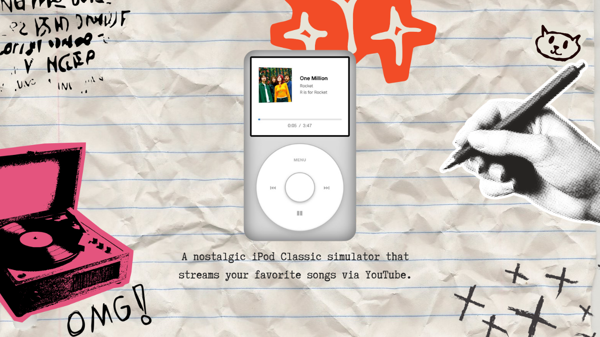

# ytPod

A fully functional iPod Classic web player powered by YouTube videos. Features authentic click wheel controls, realistic iPod UI, and seamless playback.

[](https://nostalgic-sounds.com/ipod/)

## Features

- **Authentic iPod Classic Design**: Faithful recreation of the iconic iPod Classic interface
- **Click Wheel Controls**: Full touch/mouse support for the circular click wheel
- **YouTube Integration**: Plays any YouTube video as audio
- **Auto-Play Next**: Automatically advances to the next song when one finishes
- **Now Playing View**: Displays album art, track info, and playback progress
- **Marquee Text**: Long song titles scroll automatically when selected or playing
- **Playing Indicator**: Visual indicator shows which song is currently playing in the menu
- **Smart Navigation**: Return to "Now Playing" without restarting the current song
- **Overflow Detection**: Text only scrolls when it actually overflows the container
- **Responsive Design**: Adapts to different screen sizes

## Installation

### NPM (Coming Soon)
```bash
npm install ytpod
```

### Manual Installation

1. Copy the `src/components` folder to your project
2. Install peer dependencies:
```bash
npm install react react-dom
npm install --save-dev @types/react @types/react-dom typescript
```

## Usage

### Basic Example

```tsx
import IPod from './components/iPod';

const songs = [
  {
    title: "Song Title",
    artist: "Artist Name",
    album: "Album Name",
    image: "https://example.com/cover.jpg",
    youtubeId: "dQw4w9WgXcQ"
  },
  // ... more songs
];

function App() {
  return <IPod songs={songs} />;
}
```

### Song Object Structure

```typescript
interface Song {
  title: string;       // Track title
  artist: string;      // Artist name
  album?: string;      // Album name (optional)
  image: string;       // Album art URL
  youtubeId: string;   // YouTube video ID
}
```

## Controls

### Click Wheel
- **Scroll**: Drag finger/mouse around the wheel to navigate menu
- **Menu Button** (Top): Return to menu / Go back
- **Play/Pause Button** (Bottom): Toggle playback
- **Previous Button** (Left): Go to previous song
- **Next Button** (Right): Go to next song
- **Select Button** (Center): Play selected song / Toggle to Now Playing view

## Browser Compatibility

- Chrome/Edge: Full support
- Firefox: Full support
- Safari: Full support
- Mobile browsers: Full support (touch gestures)

## Technical Details

### Dependencies
- React 18+
- YouTube IFrame Player API (loaded automatically)

### File Structure
```
ytPod/
├── src/
│   └── components/
│       ├── iPod.tsx       # Main component
│       └── iPod.css       # Styles
├── package.json
├── README.md
└── CREDITS.md
```

## Customization

### Styling
All styles are contained in `iPod.css` and can be customized. The component uses CSS custom properties for easy theming.

### Component Props
```typescript
interface IPodProps {
  songs: Song[];
}
```

## Credits

This project is built upon [iPod.js](https://github.com/tvillarete/ipod-classic-js) by [Tanner Villarete](https://github.com/tvillarete). See [CREDITS.md](./CREDITS.md) for detailed information about what was retained from the original and what was newly implemented.

## License

MIT License - see LICENSE file for details

## Contributing

Contributions are welcome! Please feel free to submit a Pull Request.

## Roadmap

- [ ] NPM package release
- [ ] Volume controls
- [ ] Playlist support
- [ ] Shuffle mode
- [ ] Repeat modes
- [ ] Search functionality
- [ ] Custom color themes

## Support

For issues and questions, please open an issue on GitHub.
